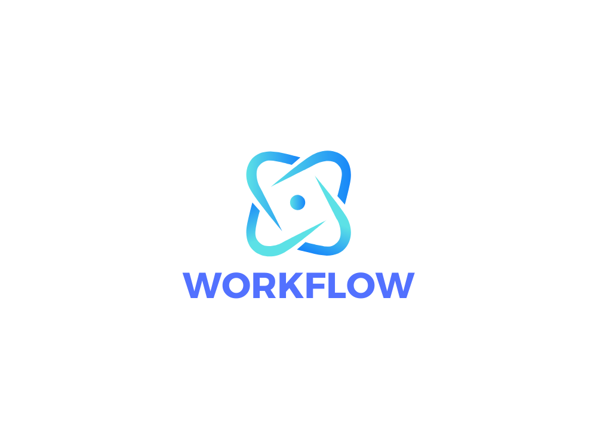

        
    

        
        
        
        
        
        
        
        
        
    

## Workflow is a Golang workflow framework that encompasses these main features:
- Defining small units of work called "Steps"
- Consumer management and graceful shutdown
- Supports event streaming platforms such as Kafka and Reflex (or you can write your own implementation of the EventStreamer interface!)
- Built in support for timeout operations (e.g. account cool down periods etc).
- Built in support for callbacks (e.g. Call an async endpoint and trigger the callback from a webhook handler).
- Connect two workflows together. Wait for specific events from another workflow and make it part of your workflow!
- Super Duper testable

## Example

Head on over to `./examples` to get familiar with the syntax 😊

## Glossary

1. **API:**
    - An interface providing methods for interacting with workflows. It includes functionality for triggering, scheduling, awaiting, and stopping workflows.

2. **Await:**
    - A method in the workflow API that blocks until a workflow with a specific runID reaches a specified status. It returns the record associated with that status.

3. **Builder:**
    - A struct type that facilitates the construction of workflows. It provides methods for adding steps, callbacks, timeouts, and connecting workflows.

4. **Build:**
    - A method in the builder that finalizes the construction of the workflow and returns the built workflow.

5. **BuildOption:**
    - A functional option for configuring the build process, such as specifying a custom clock or enabling debug mode.

6. **Callback:**
    - A method in the workflow API that can be used to trigger a callback function for a specified status. It passes data from a reader to the specified callback function.

7. **CallbackFunc:**
    - A function type representing a callback in the workflow, triggered when transitioning from one status to another.

8. **ConnectWorkflow:**
    - A method in the builder that connects a workflow to another workflow using a connector configuration.

9. **ConnectorConfig:**
    - A configuration struct representing the settings for a connector, including workflow name, status, stream, filter, and consumer.

10. **Consumer:**
    - A component that consumes events from an event stream. In this context, it refers to the background consumer goroutines launched by the workflow.

11. **ConsumerFunc:**
    - A function type representing a step in the workflow that consumes records and transitions to a specified status.

12. **DebugMode:**
    - A configuration option that, when enabled, causes the workflow to operate in debug mode, providing additional information or logging for debugging purposes.

13. **DurationTimerFunc:**
    - A function that creates a timer function based on a specified duration.

14. **Endpoints:**
    - Statuses in the workflow that do not have any outgoing transitions, indicating the end points of the workflow.

15. **EventStreamer:**
    - An interface representing a stream for workflow events. It includes methods for producing and consuming events.

16. **Graph:**
    - A representation of the workflow's structure, showing the relationships between different statuses and transitions.

17. **InternalState:**
    - A map holding the state of all expected consumers and timeout goroutines using their role names as keys. It is protected by a mutex to ensure thread safety.

18. **MermaidDiagram:**
    - A function generating a Mermaid diagram for the workflow structure based on the provided Workflow, path, and MermaidDirection.

19. **MermaidDirection:**
    - A type representing the direction of the Mermaid diagram, such as TopToBottom, LeftToRight, RightToLeft, or BottomToTop.

20. **Not:**
    - A function that negates the result of another consumer function, used as a filter for steps.

21. **Producer:**
    - A component that produces events to an event stream. It is responsible for sending events to the stream.

22. **RecordStore:**
    - An interface representing a store for workflow records. It includes methods for storing and retrieving records.

23. **RoleScheduler:**
    - An interface representing a scheduler for roles in the workflow. It is responsible for coordinating the execution of different roles.

24. **Run:**
    - A method in the workflow struct that starts background processes necessary for running the workflow, such as consumers, timeouts, and connectors.

25. **Schedule:**
    - A method in the workflow API that schedules workflow triggers at specified intervals using a cron-like specification.

26. **State:**
    - An enumeration representing the state of a consumer or timeout goroutine. Possible states include StateUnknown, StateShutdown, and others.

27. **StepOption:**
    - A functional option for configuring step-specific settings, such as parallel count, polling frequency, and error backoff.

28. **TimeoutFunc:**
    - A function type representing a timeout action in the workflow, executed when a specified time duration has elapsed.

29. **TimeoutOption:**
    - A functional option for configuring timeout-specific settings, such as polling frequency and error backoff.

30. **Topic:**
    - A method that generates a topic for producing events in the event streamer based on the workflow name and status.

31. **TimerFunc:**
    - A function type used to calculate the time for a timeout. It takes a context, record, and the current time as inputs.

32. **Trigger:**
    - A method in the workflow API that initiates a workflow for a specified foreignID and starting status. It returns a runID and allows for additional configuration options.

33. **WithClock:**
    - A build option that sets a custom clock for the workflow.

34. **WithDebugMode:**
    - A build option that enables debug mode for the workflow.

35. **WithParallelCount:**
    - A step option that sets the parallel count for a step, indicating how many instances of the step can run concurrently.

36. **WithStepErrBackOff:**
    - A step option that sets the error backoff duration for a step, specifying the time to wait before retrying in case of an error.

37. **WithStepPollingFrequency:**
    - A step option that sets the polling frequency for a step, determining how often the step should check for updates.

38. **WithTimeoutErrBackOff:**
    - A timeout option that sets the error backoff duration for a timeout transition.

39. **WithTimeoutPollingFrequency:**
    - A timeout option that sets the polling frequency for a timeout transition.

40. **WireFormat:**
    - A format used for serializing and deserializing data for communication between workflow components. It refers to the wire format of the WireRecord.

41. **WireRecord:**
    - A struct representing a record with additional metadata used for communication between workflow components. It can be marshaled to a wire format for storage and transmission.

## Authors

- [@andrewwormald](https://github.com/andrewwormald)
