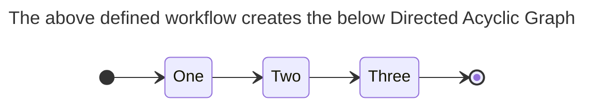
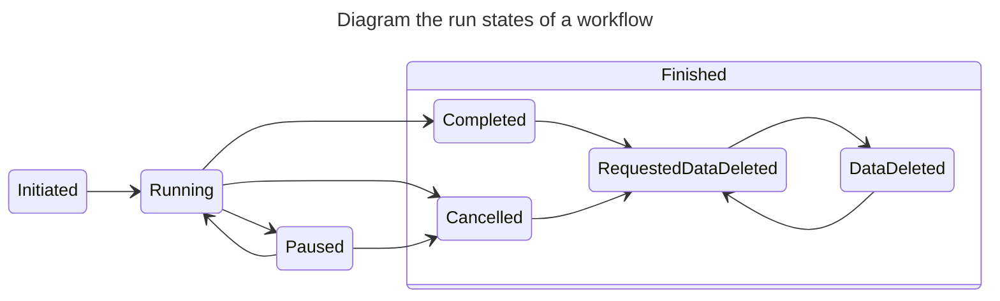

<div align="center">
    
    <div  align="center" style="max-width: 750px">
        <a style="padding: 0 5px" href="https://goreportcard.com/report/github.com/luno/workflow"></a>
        <a style="padding: 0 5px" href="https://sonarcloud.io/summary/new_code?id=luno_workflow"></a>
        <a style="padding: 0 5px" href="https://sonarcloud.io/summary/new_code?id=luno_workflow"></a>
        <a style="padding: 0 5px" href="https://sonarcloud.io/summary/new_code?id=luno_workflow"></a>
        <a style="padding: 0 5px" href="https://sonarcloud.io/summary/new_code?id=luno_workflow"></a><a style="text-decoration:none; padding: 0 5px" href="https://sonarcloud.io/summary/new_code?id=luno_workflow" ></a>
        <a style="padding: 0 5px" href="https://sonarcloud.io/summary/new_code?id=luno_workflow"></a>
        <a style="padding: 0 5px" href="https://sonarcloud.io/summary/new_code?id=luno_workflow"></a>
        <a style="padding: 0 5px" href="https://sonarcloud.io/summary/new_code?id=luno_workflow"></a>
        <a style="padding: 0 5px" href="https://pkg.go.dev/github.com/luno/workflow"></a>
    </div>
</div>

# Workflow

[Workflow](https://github.com/luno/workflow) is a distributed event driven workflow framework than runs robust, durable, and
scalable sequential business logic on your services.

[Workflow](https://github.com/luno/workflow) uses a [RoleScheduler](https://github.com/luno/workflow/blob/main/rolescheduler.go) to distribute the work
 across your instances through a role assignment process (similar to a leadership election process but with more than
 the single role of leader).

[Workflow](https://github.com/luno/workflow) expects to be run on multiple instances but can also be run on single
 instances. Using the above-mentioned [RoleScheduler](https://github.com/luno/workflow/blob/main/rolescheduler.go),
[Workflow](https://github.com/luno/workflow) is able to make sure each process only runs once at any given time
 regardless if you are running 40 instances of your service or 1 instance.

---

## Features

- **Tech stack agnostic:** Use Kafka, Cassandra, Redis, MongoDB, Postgresql, MySQL, RabbitM, or Reflex - the choice is yours!
- **Graph based (Directed Acyclic Graph - DAG):** Design the workflow by defining small units of work called "Steps".
- **TDD:** Workflow was built using TDD and remains well-supported through a suit of tools.
- **Schedule:** Allows standard cron spec to schedule workflows 
- **Timeouts:** Set either a dynamic or static time for a workflow to wait for. Once the timeout finishes everything continues as it was.
- **Event fusion:** Add event connectors to your workflow to consume external event streams (even if its from a different event streaming platform).  
- **Callbacks:** Allow for manual callbacks from webhooks or manual triggers from consoles to progress the workflow such as approval buttons or third-party webhooks.  
- **Parallel consumers:** Specify how many step consumers should run or specify the default for all consumers. 
- **Consumer management:** Consumer management and graceful shutdown of all processes making sure there is no goroutine leaks!

---

## Installation
To start using workflow you will need to add the workflow module to your project. You can do this by running:
```bash
go get github.com/luno/workflow
```

### Adapters
Some adapters dont come with the core workflow module such as `kafkastreamer`, `reflexstreamer`, `sqlstore`, and `sqltimeout`. If you
 wish to use these you need to add them individually based on your needs or build out your own adapter.

#### Kafka
```bash
go get github.com/luno/workflow/adapters/kafkastreamer
```

#### Reflex
```bash
go get github.com/luno/workflow/adapters/reflexstreamer
```

#### SQL Store
```bash
go get github.com/luno/workflow/adapters/sqlstore
```

#### SQL Timeout
```bash
go get github.com/luno/workflow/adapters/sqltimeout
```
---
## Usage

### Step 1: Define the workflow
```go
package usage

import (
	"context"

	"github.com/luno/workflow"
)

type Step int

func (s Step) String() string {
	switch s {
	case StepOne:
		return "One"
	case StepTwo:
		return "Two"
	case StepThree:
		return "Three"
	default:
		return "Unknown"
	}
}

const (
	StepUnknown Step = 0
	StepOne Step = 1
	StepTwo Step = 2
	StepThree Step = 3
)

type MyType struct {
	Field string
}

func Workflow() *workflow.Workflow[MyType, Step] {
	b := workflow.NewBuilder[MyType, Step]("my workflow name")

	b.AddStep(StepOne, func(ctx context.Context, r *workflow.Run[MyType, Step]) (Step, error) {
		r.Object.Field = "Hello,"
		return StepTwo, nil
	}, StepTwo)

	b.AddStep(StepTwo, func(ctx context.Context, r *workflow.Run[MyType, Step]) (Step, error) {
		r.Object.Field += " world!"
		return StepThree, nil
	}, StepThree)

	return b.Build(...)
}
```

### Step 2: Run the workflow
```go
wf := usage.Workflow()

ctx := context.Background()
wf.Run(ctx)
```
**Stop:** To stop all processes and wait for them to shut down correctly call
```go
wf.Stop()
```
### Step 3: Trigger the workflow
```go
foreignID := "82347982374982374"
runID, err := wf.Trigger(ctx, foreignID, StepOne)
if err != nil {
	...
}
```
**Awaiting results:** If appropriate and desired you can wait for the workflow to complete. Using context timeout (cancellation) is advised.
```go
foreignID := "82347982374982374"
runID, err := wf.Trigger(ctx, foreignID, StepOne)
if err != nil {
	...
}

ctx, cancel := context.WithTimeout(ctx, 10 * time.Second)
defer cancel()

record, err := wf.Await(ctx, foreignID, runID, StepThree)
if err != nil {
	...
}
```

### Detailed examples
Head on over to [./_examples](./_examples) to get familiar with **callbacks**, **timeouts**, **testing**, **connectors** and
 more about the syntax in depth 😊

---

### What is a workflow Run

When a Workflow is triggered it creates an individual workflow instance called a Run. This is represented as workflow.Run in
[Workflow](https://github.com/luno/workflow). Each run has a lifecycle which is a finite set of states - commonly
referred to as Finite State Machine. Each
 workflow Run has the following of states (called RunState in [Workflow](https://github.com/luno/workflow)):

1. Initiated
2. Running
3. Paused
4. Completed
5. Cancelled
6. Data Deleted
7. Requested Data Deleted

A Run can only exist in one state at any given time and the RunState allows for control over the Run.

---
## Hooks

Hooks allow for you to write some functionality for Runs that enter a specific RunState. For example when
using `PauseAfterErrCount` the usage of the OnPause hook can be used to send a notification to a team to notify
them that a specific Run has errored to the threshold and now has been paused and should be investigated. Another
example is handling a known sentinel error in a Workflow Run and cancelling the Run by calling (where r is *Run)
r.Cancel(ctx) or if a Workflow Run is manually cancelled from a UI then a notifgication can be sent to the team for visibility.

Hooks run in an event consumer. This means that it will retry until a nil error has been returned and is durable
across deploys and interruptions. At-least-once delivery is guaranteed, and it is advised to use the RunID as an
idempotency key to ensure that the operation is idempotent.

### Available Hooks:

| Hook          | Parameter(s)                    | Return(s) | Description                               | Is Event Driven? |
|---------------|---------------------------------|-----------|-------------------------------------------|------------------|
| OnPause       | workflow.RunStateChangeHookFunc | error     | Fired when a Run enters RunStatePaused    | Yes              |
| OnCancelled   | workflow.RunStateChangeHookFunc | error     | Fired when a Run enters RunStateCancelled | Yes              |
| OnCompleted   | workflow.RunStateChangeHookFunc | error     | Fired when a Run enters RunStateCompleted | Yes              |

---

## Configuration Options

This package provides several options to configure the behavior of the workflow process. You can use these options to customize the instance count, polling frequency, error handling, lag settings, and more. Each option is defined as a function that takes a pointer to an `options` struct and modifies it accordingly. Below is a description of each available option:

### `ParallelCount`

```go
func ParallelCount(instances int) Option
```

- **Description:** Defines the number of instances of the workflow process. These instances are distributed consistently, each named to reflect its position (e.g., "consumer-1-of-5"). This helps in managing parallelism in workflow execution.
- **Parameters:**
    - `instances`: The total number of parallel instances to create.
- **Usage Example:**
```go
b.AddStep(
    StepOne,
    ...,
    StepTwo,
).WithOptions(
    workflow.ParallelCount(5)
)
```

### `PollingFrequency`

```go
func PollingFrequency(d time.Duration) Option
```

- **Description:** Sets the duration at which the workflow process polls for changes. Adjust this to control how frequently the process checks for new events or updates.
- **Parameters:**
    - `d`: The polling frequency as a `time.Duration`.
- **Usage Example:**
```go
b.AddStep(
    StepOne,
    ...,
    StepTwo,
).WithOptions(
    workflow.PollingFrequency(10 * time.Second)
)
```

### `ErrBackOff`

```go
func ErrBackOff(d time.Duration) Option
```

- **Description:** Defines the duration for which the workflow process will back off after encountering an error. This is useful for managing retries and avoiding rapid repeated failures.
- **Parameters:**
    - `d`: The backoff duration as a `time.Duration`.
- **Usage Example:**
```go
b.AddStep(
    StepOne,
    ...,
    StepTwo,
).WithOptions(
    workflow.ErrBackOff(5 * time.Minute)
)
```
### `LagAlert`

```go
func LagAlert(d time.Duration) Option
```

- **Description:** Specifies the time threshold before a Prometheus metric switches to true, indicating that the workflow consumer is struggling to keep up. This can signal the need to convert to a parallel consumer.
- **Parameters:**
    - `d`: The duration of the lag alert as a `time.Duration`.
- **Usage Example:**
```go
b.AddStep(
    StepOne,
    ...,
    StepTwo,
).WithOptions(
    workflow.LagAlert(15 * time.Minute),
)
```
### `ConsumeLag`

```go
func ConsumeLag(d time.Duration) Option
```

- **Description:** Defines the maximum age of events that the consumer will process. Events newer than the specified duration will be held until they are older than the lag period.
- **Parameters:**
    - `d`: The lag duration as a `time.Duration`.
- **Usage Example:**
```go
b.AddStep(
    StepOne,
    ...,
    StepTwo,
).WithOptions(
    workflow.ConsumeLag(10 * time.Minute),
)
```
### `PauseAfterErrCount`

```go
func PauseAfterErrCount(count int) Option
```

- **Description:** Sets the number of errors allowed before a record is updated to `RunStatePaused`. This mechanism acts similarly to a Dead Letter Queue, preventing further processing of problematic records and allowing for investigation and retry.
- **Parameters:**
    - `count`: The maximum number of errors before pausing.
- **Usage Example:**
```go
b.AddStep(
    StepOne,
    ...,
    StepTwo,
).WithOptions(
    workflow.PauseAfterErrCount(3),
)
```

---

## Glossary

| **Term**          | **Description**                                                                                                                                                                                                       |
|-------------------|-----------------------------------------------------------------------------------------------------------------------------------------------------------------------------------------------------------------------|
| **Builder**       | A struct type that facilitates the construction of workflows. It provides methods for adding steps, callbacks, timeouts, and connecting workflows.                                                                    |
| **Callback**      | A method in the workflow API that can be used to trigger a callback function for a specified status. It passes data from a reader to the specified callback function.                                                 |
| **Consumer**      | A component that consumes events from an event stream. In this context, it refers to the background consumer goroutines launched by the workflow.                                                                     |
| **EventStreamer** | An interface representing a stream for workflow events. It includes methods for producing and consuming events.                                                                                                       |
| **Graph**         | A representation of the workflow's structure, showing the relationships between different statuses and transitions.                                                                                                   |
| **Hooks**         | An event driven process that take place on a Workflow's Run's lifecycle defined in a finite number of states called RunState.                                                                                         |
| **Producer**      | A component that produces events to an event stream. It is responsible for sending events to the stream.                                                                                                              |
| **Record**        | Is the "wire format" and representation of a Run that can be stored and retrieved. The RecordStore is used for storing and retrieving records.                                                                        |
| **RecordStore**   | An interface representing a store for Record(s). It defines the methods needed for storing and retrieving records. The RecordStore's underlying technology must support transactions in order to prevent dual-writes. |
| **RoleScheduler** | An interface representing a scheduler for roles in the workflow. It is responsible for coordinating the execution of different roles.                                                                                 |
| **Run**           | A Run is the representation of the instance that is created and processed by the Workflow. Each time Trigger is called a new "Run" is created.                                                                        |
| **RunState**      | RunState defines the finite number of states that a Run can be in. This is used to control and monitor the lifecycle of Runs.                                                                                         |
| **Topic**         | A method that generates a topic for producing events in the event streamer based on the workflow name and status.                                                                                                     |
| **Trigger**       | A method in the workflow API that initiates a workflow for a specified foreignID and starting status. It returns a Run ID and allows for additional configuration options.                                            |

---

## Best practices

1. Break up complex business logic into small steps.
2. [Workflow](https://github.com/luno/workflow) can be used to produce new meaningful data and not just be used to execute logic. If it is it's suggested
to implement a CQRS pattern where the workflow acts as the "Command" and the data is persisted into a more queryable manner.
3. Changes to workflows must be backwards compatible. If you need to introduce a non-backwards compatible change
   then the non-backwards compatible workflow should be added alongside the existing workflow with
   the non-backwards compatible workflow receiving all the incoming triggers. The old workflow should be given time
   to finish processing any workflows it started and once it has finished processing all the existing non-finished Runs
   then it may be safely removed. Alternatively versioning can be added internally to your Object type that you provide
   but this results in changes to the workflow's Directed Acyclic Graph (map of steps connecting together).
4. [Workflow](https://github.com/luno/workflow) is not intended for low-latency. Asynchronous event driven systems are not meant to be low-latency but
   prioritise decoupling, durability, distribution of workload, and breakdown of complex logic (to name a few).
5. Ensure that the prometheus metrics that come with [Workflow](https://github.com/luno/workflow) are being used for monitoring and alerting.
