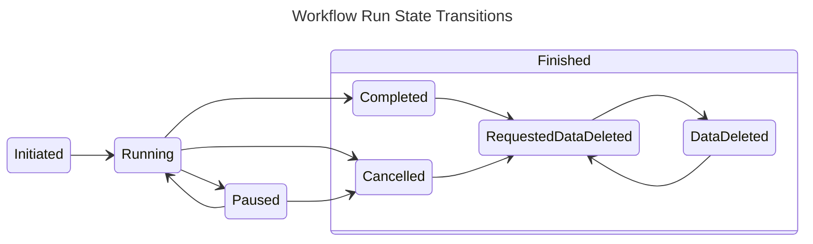

<div align="center">
    
    <div  align="center" style="max-width: 750px">
        <a style="padding: 0 5px" href="https://goreportcard.com/report/github.com/luno/workflow"></a>
        <a style="padding: 0 5px" href="https://sonarcloud.io/summary/new_code?id=luno_workflow"></a>
        <a style="padding: 0 5px" href="https://sonarcloud.io/summary/new_code?id=luno_workflow"></a>
        <a style="padding: 0 5px" href="https://sonarcloud.io/summary/new_code?id=luno_workflow"></a>
        <a style="padding: 0 5px" href="https://sonarcloud.io/summary/new_code?id=luno_workflow"></a><a style="text-decoration:none; padding: 0 5px" href="https://sonarcloud.io/summary/new_code?id=luno_workflow" ></a>
        <a style="padding: 0 5px" href="https://sonarcloud.io/summary/new_code?id=luno_workflow"></a>
        <a style="padding: 0 5px" href="https://sonarcloud.io/summary/new_code?id=luno_workflow"></a>
        <a style="padding: 0 5px" href="https://sonarcloud.io/summary/new_code?id=luno_workflow"></a>
        <a style="padding: 0 5px" href="https://pkg.go.dev/github.com/luno/workflow"></a>
        <a style="padding: 0 5px" href="https://github.com/avelino/awesome-go"></a>
    </div>
</div>

# Workflow

A type-safe, event-driven workflow orchestration library for Go that provides durable execution of multi-step business processes with built-in observability and horizontal scaling.

## Overview

**Workflow** is a distributed workflow framework designed to run robust, durable, and scalable sequential business logic. It takes an event-driven approach where workflows are defined as type-safe state machines, automatically persisted, and distributed across multiple instances through role-based scheduling.

**Key Features:**
- **Type-safe state machines**: Compile-time guarantees using Go generics
- **Event-driven architecture**: Asynchronous processing with automatic persistence
- **Pluggable adapters**: Support for any database, message queue, or storage system
- **Horizontal scaling**: Role-based scheduling ensures distributed execution
- **Built-in observability**: Metrics, logging, and web UI for monitoring
- **Rich feature set**: Callbacks, timeouts, connectors, and lifecycle hooks

## When to Use Workflow

**Perfect for:**
- Order processing pipelines with validation and fulfillment steps
- User onboarding flows with verification and approval processes
- Payment processing with retries, fraud checks, and settlements
- Data processing pipelines with transformation and validation
- Complex approval workflows with multiple stakeholders

**Choose Workflow over alternatives when:**
- You need tight Go integration with compile-time type safety
- You prefer event-driven patterns over RPC-style definitions
- You want full control over your infrastructure choices
- You need lightweight deployment without external dependencies

## Core Architecture

### State Machines & Events
Workflows are defined as directed acyclic graphs (DAGs) where each step is a typed function:

```go
type OrderStatus int
const (
    OrderCreated OrderStatus = iota + 1
    PaymentProcessed
    InventoryReserved
    OrderFulfilled
)

type Order struct {
    ID     string
    Amount float64
    Items  []Item
}

// Define workflow steps
b := workflow.NewBuilder[Order, OrderStatus]("order-processing")
b.AddStep(OrderCreated, ProcessPayment, PaymentProcessed)
b.AddStep(PaymentProcessed, ReserveInventory, InventoryReserved)
b.AddStep(InventoryReserved, FulfillOrder, OrderFulfilled)
```

### Event-Driven Processing
When steps complete, events are published to drive progression:

```go
type Event struct {
    ID        int64             // Unique event identifier
    ForeignID string            // Links to workflow instance
    Type      int               // Status the workflow moved to
    Headers   map[Header]string // Metadata
    CreatedAt time.Time         // Event timestamp
}
```

### Role-Based Distribution
Each step runs as a separate process with unique roles, enabling horizontal scaling:

```go
// Only one instance processes this role across your fleet
role := "order-processing:payment:consumer:1:of:3"
```

## Quick Start

```go
package main

import (
    "context"
    "time"
    "github.com/luno/workflow"
    "github.com/luno/workflow/adapters/memstreamer"
    "github.com/luno/workflow/adapters/memrecordstore"
    "github.com/luno/workflow/adapters/memrolescheduler"
)

// 1. Define your types
type Status int
const (
    StatusStarted Status = iota + 1
    StatusProcessed
    StatusCompleted
)

type Task struct {
    Name        string
    ProcessedAt *time.Time
}

// 2. Build the workflow
func NewTaskWorkflow() *workflow.Workflow[Task, Status] {
    b := workflow.NewBuilder[Task, Status]("task-processor")

    b.AddStep(StatusStarted, func(ctx context.Context, r *workflow.Run[Task, Status]) (Status, error) {
        now := time.Now()
        r.Object.ProcessedAt = &now
        return StatusProcessed, nil
    }, StatusProcessed)

    b.AddStep(StatusProcessed, func(ctx context.Context, r *workflow.Run[Task, Status]) (Status, error) {
        // Do processing work
        return StatusCompleted, nil
    }, StatusCompleted)

    return b.Build(
        memstreamer.New(),
        memrecordstore.New(),
        memrolescheduler.New(),
    )
}

func main() {
    wf := NewTaskWorkflow()

    // Start background processing
    ctx := context.Background()
    wf.Run(ctx)
    defer wf.Stop()

    // Trigger a workflow instance
    runID, err := wf.Trigger(ctx, "task-123")
    if err != nil {
        panic(err)
    }

    // Wait for completion
    run, err := wf.Await(ctx, "task-123", runID, StatusCompleted)
    if err != nil {
        panic(err)
    }

    fmt.Printf("Task completed: %+v\n", run.Object)
}
```

## Advanced Features

### Timeouts & Scheduling
Handle time-based operations with durable timeouts:

```go
b.AddTimeout(
    StatusPaymentPending,
    workflow.DurationTimerFunc[Order, OrderStatus](30*time.Minute),
    func(ctx context.Context, r *workflow.Run[Order, OrderStatus], now time.Time) (OrderStatus, error) {
        return StatusPaymentExpired, nil
    },
    StatusPaymentExpired,
)
```

### Callbacks & External Events
Handle webhooks and manual interventions:

```go
b.AddCallback(StatusPendingApproval, func(ctx context.Context, r *workflow.Run[Order, OrderStatus], reader io.Reader) (OrderStatus, error) {
    // Handle approval webhook
    return StatusApproved, nil
})

// Trigger callback from webhook handler
err := wf.Callback(ctx, "order-123", StatusPendingApproval, approvalPayload)
```

### Event Connectors
Connect to external event streams:

```go
b.AddConnector("payment-events",
    kafkaConnector,
    func(ctx context.Context, api workflow.API[Order, OrderStatus], event *workflow.ConnectorEvent) error {
        return api.Trigger(ctx, event.ForeignID, workflow.WithStartAt(StatusPaymentReceived))
    },
)
```

### Lifecycle Hooks
React to workflow state changes:

```go
b.OnPause(func(ctx context.Context, r *workflow.Run[Order, OrderStatus]) error {
    // Send alert when workflow pauses due to errors
    return sendAlert("Workflow paused", r.ForeignID)
})

b.OnComplete(func(ctx context.Context, r *workflow.Run[Order, OrderStatus]) error {
    // Clean up resources, send notifications
    return notifyCompletion(r.Object)
})
```

## Installation

To start using workflow, add the workflow module to your project:

```bash
go get github.com/luno/workflow
```

## Adapters

Adapters enable **Workflow** to be tech stack agnostic by placing an interface/protocol between **Workflow** and your chosen technology stack. **Workflow** uses adapters to understand how to interact with different systems.

For example, the Kafka adapter enables workflow to produce and consume messages using predefined methods that wrap the kafka client. [Reflex](https://github.com/luno/reflex) is an event streaming framework that works differently to Kafka, and the adapter pattern allows these differences to be contained within the adapter.

### Event Streamer
The [EventStreamer](eventstreamer.go) adapter interface defines what is needed for an event streaming platform to be used by **Workflow**.

All implementations should be tested using [adaptertest.TestEventStreamer](adapters/adaptertest/eventstreaming.go).

**Available adapters:**
- **kafkastreamer**: Apache Kafka integration with consumer groups
- **reflexstreamer**: Integration with Luno's Reflex event sourcing library
- **memstreamer**: In-memory event streaming for testing

```bash
# Kafka
go get github.com/luno/workflow/adapters/kafkastreamer

# Reflex
go get github.com/luno/workflow/adapters/reflexstreamer
```

### Record Store
The [RecordStore](store.go) adapter interface defines what is needed for a storage solution to be used by **Workflow**.

All implementations should be tested using [adaptertest.RunRecordStoreTest](adapters/adaptertest/recordstore.go).

**Available adapters:**
- **sqlstore**: Production SQL storage (MySQL, PostgreSQL)
- **memrecordstore**: In-memory storage for testing

```bash
# SQL Store
go get github.com/luno/workflow/adapters/sqlstore
```

### Role Scheduler
The [RoleScheduler](rolescheduler.go) adapter interface defines what is needed for a role scheduling solution to be used by **Workflow**.

All implementations should be tested using [adaptertest.RunRoleSchedulerTest](adapters/adaptertest/rolescheduler.go).

**Available adapters:**
- **rinkrolescheduler**: Distributed scheduling via Luno's Rink library
- **memrolescheduler**: Single-instance scheduling for development

```bash
# Rink Role Scheduler
go get github.com/luno/workflow/adapters/rinkrolescheduler
```

### Additional Adapters
- **sqltimeout**: SQL-based durable timeout scheduling
- **webui**: Web interface for monitoring and debugging workflows
- **jlog**: Structured logging integration

```bash
# SQL Timeout
go get github.com/luno/workflow/adapters/sqltimeout

# WebUI
go get github.com/luno/workflow/adapters/webui
```

**Note:** Adapters (except in-memory implementations) are separate modules that must be added individually based on your needs, or you can build your own adapter.

---

## Connectors

Connectors allow **Workflow** to consume events from external event streaming platforms and either trigger a workflow run or provide a callback to an existing workflow run. This enables **Workflow** to connect with the rest of your system through event fusion.

Connectors are implemented as adapters since they share similar functionality with EventStreamer implementations.

An example can be found [here](_examples/connector).

---

## What is a Workflow Run

When a **Workflow** is triggered, it creates an individual workflow instance called a **Run**. Each run has a lifecycle represented as a finite state machine with the following states:

| Run State | Value | Description |
|-----------|-------|-------------|
| Unknown | 0 | Default zero value, has no meaning |
| Initiated | 1 | Assigned at creation, yet to be processed |
| Running | 2 | Currently being processed by a workflow step |
| Paused | 3 | Temporary stoppage that can be resumed or cancelled. Prevents new triggers for the same Foreign ID |
| Completed | 4 | Successfully finished all configured steps |
| Cancelled | 5 | Terminated before completion |
| Data Deleted | 6 | Run Object has been modified to remove data (e.g., PII scrubbing) |
| Requested Data Deleted | 7 | Request state for applying delete operation to Run Object |

A Run can only exist in one state at any given time, and the RunState allows for control over the Run.



---

## Hooks

Hooks allow you to write functionality that executes when Runs enter specific RunStates. For example, when using `PauseAfterErrCount`, you can use the OnPause hook to send notifications when a Run has errored beyond the threshold and been paused for investigation.

Hooks run in event consumers with retry mechanisms until a nil error is returned, providing durability across deploys and interruptions. At-least-once delivery is guaranteed - use the RunID as an idempotency key to ensure operations are idempotent.

### Available Hooks:

| Hook | Parameter | Return | Description | Event Driven? |
|------|-----------|---------|-------------|---------------|
| OnPause | RunStateChangeHookFunc | error | Fired when a Run enters RunStatePaused | Yes |
| OnCancel | RunStateChangeHookFunc | error | Fired when a Run enters RunStateCancelled | Yes |
| OnComplete | RunStateChangeHookFunc | error | Fired when a Run enters RunStateCompleted | Yes |

```go
b.OnPause(func(ctx context.Context, r *workflow.Run[Order, Status]) error {
    // Send alert when workflow pauses due to errors
    return sendAlert("Workflow paused", r.ForeignID)
})
```

---

## Configuration Options

This package provides several options to configure the behavior of workflow processes. You can use these options to customize instance count, polling frequency, error handling, lag settings, and more.

### `ParallelCount`

```go
func ParallelCount(instances int) Option
```

**Description:** Defines the number of instances of the workflow process. These instances are distributed consistently, each named to reflect its position (e.g., "consumer-1-of-5"). This helps in managing parallelism in workflow execution.

**Usage Example:**
```go
b.AddStep(
    StepOne,
    ...,
    StepTwo,
).WithOptions(
    workflow.ParallelCount(5)
)
```

### `PollingFrequency`

```go
func PollingFrequency(d time.Duration) Option
```

**Description:** Sets the duration at which the workflow process polls for changes. Adjust this to control how frequently the process checks for new events or updates.

**Usage Example:**
```go
b.AddStep(
    StepOne,
    ...,
    StepTwo,
).WithOptions(
    workflow.PollingFrequency(10 * time.Second)
)
```

### `ErrBackOff`

```go
func ErrBackOff(d time.Duration) Option
```

**Description:** Defines the duration for which the workflow process will back off after encountering an error. This is useful for managing retries and avoiding rapid repeated failures.

**Usage Example:**
```go
b.AddStep(
    StepOne,
    ...,
    StepTwo,
).WithOptions(
    workflow.ErrBackOff(5 * time.Minute)
)
```

### `LagAlert`

```go
func LagAlert(d time.Duration) Option
```

**Description:** Specifies the time threshold before a Prometheus metric switches to true, indicating that the workflow consumer is struggling to keep up. This can signal the need to convert to a parallel consumer.

**Usage Example:**
```go
b.AddStep(
    StepOne,
    ...,
    StepTwo,
).WithOptions(
    workflow.LagAlert(15 * time.Minute),
)
```

### `ConsumeLag`

```go
func ConsumeLag(d time.Duration) Option
```

**Description:** Defines the maximum age of events that the consumer will process. Events newer than the specified duration will be held until they are older than the lag period.

**Usage Example:**
```go
b.AddStep(
    StepOne,
    ...,
    StepTwo,
).WithOptions(
    workflow.ConsumeLag(10 * time.Minute),
)
```

### `PauseAfterErrCount`

```go
func PauseAfterErrCount(count int) Option
```

**Description:** Sets the number of errors allowed before a record is updated to `RunStatePaused`. This mechanism acts similarly to a Dead Letter Queue, preventing further processing of problematic records and allowing for investigation and retry.

**Usage Example:**
```go
b.AddStep(
    StepOne,
    ...,
    StepTwo,
).WithOptions(
    workflow.PauseAfterErrCount(3),
)
```

### Global Configuration

Apply options to the entire workflow:

```go
wf := b.Build(
    eventStreamer, recordStore, roleScheduler,
    workflow.WithDefaultOptions(
        workflow.ParallelCount(5),
        workflow.ErrBackOff(time.Second),
    ),
    workflow.WithDebugMode(),
    workflow.WithTimeoutStore(timeoutStore),
)
```

## Monitoring & Observability

### Built-in Metrics
Workflow exposes Prometheus metrics for monitoring:
- Consumer lag and throughput
- Error rates and pause counts
- Processing times and queue depths

### Web UI
Monitor workflows in real-time:

```go
// Add to your HTTP server
http.Handle("/", webui.HomeHandlerFunc(webui.Paths{
    List:       "/api/list",
    ObjectData: "/api/object",
}))
http.HandleFunc("/api/list", webui.ListHandlerFunc(recordStore))
http.HandleFunc("/api/object", webui.ObjectDataHandlerFunc(recordStore))
```

### Debugging
Enable debug mode for detailed logging:

```go
wf := b.Build(..., workflow.WithDebugMode())
```

## Production Deployment

### Scaling Patterns
- **Single Instance**: Use mem* adapters for simple deployments
- **Horizontally Scaled**: Use SQL + Kafka + Rink for production
- **Multi-Region**: Deploy role scheduler per region with shared storage

### Error Handling
```go
// Built-in error handling with pause and retry
b.AddStep(StatusProcessing, func(ctx context.Context, r *workflow.Run[Order, OrderStatus]) (OrderStatus, error) {
    if err := externalAPICall(); err != nil {
        if isRetryableError(err) {
            return 0, err // Will retry with backoff
        }
        return StatusFailed, nil // Move to failed state
    }
    return StatusCompleted, nil
}).WithOptions(workflow.PauseAfterErrCount(5))
```

### Best Practices

1. **Break up complex business logic into small steps**: Decompose complex workflows into manageable, focused steps for better maintainability and debugging.

2. **Use Workflow for meaningful data production with CQRS**: **Workflow** can produce new meaningful data, not just execute logic. Consider implementing a CQRS pattern where the workflow acts as the "Command" and data is persisted in a more queryable manner.

3. **Maintain backwards compatibility**: Changes to workflows must be backwards compatible. For non-backwards compatible changes:
   - Add the new workflow alongside the existing one
   - Route new triggers to the new workflow
   - Allow the old workflow to finish processing existing Runs
   - Remove the old workflow once all Runs are complete
   - Alternatively, add versioning to your Object type (though this affects the DAG structure)

4. **Understand latency expectations**: **Workflow** is not intended for low-latency use cases. Asynchronous event-driven systems prioritize decoupling, durability, workload distribution, and complex logic breakdown over speed.

5. **Monitor with Prometheus metrics**: Ensure the built-in Prometheus metrics are used for monitoring and alerting to maintain operational visibility.

## Comparison with Alternatives

| Feature | Workflow | Temporal | Zeebe/Camunda |
|---------|----------|----------|---------------|
| Type Safety | Compile-time (Go generics) | Runtime validation | Runtime (BPMN) |
| Architecture | Event-driven state machines | RPC-based activities | Token-based execution |
| Definition | Go code | Go/Java/Python code | BPMN XML |
| Infrastructure | Pluggable adapters | Requires Temporal cluster | External engine required |
| Deployment | Library in your app | Separate server/workers | Separate engine |
| Language Support | Go-native | Multi-language | Multi-language |

## Glossary

| **Term** | **Description** |
|----------|-----------------|
| **Builder** | A struct type that facilitates the construction of workflows. It provides methods for adding steps, callbacks, timeouts, and connecting workflows. |
| **Callback** | A method in the workflow API that can be used to trigger a callback function for a specified status. It passes data from a reader to the specified callback function. |
| **Consumer** | A component that consumes events from an event stream. In this context, it refers to the background consumer goroutines launched by the workflow. |
| **EventStreamer** | An interface representing a stream for workflow events. It includes methods for producing and consuming events. |
| **Graph** | A representation of the workflow's structure, showing the relationships between different statuses and transitions. |
| **Hooks** | Event-driven processes that take place on a Workflow's Run's lifecycle defined in a finite number of states called RunState. |
| **Producer** | A component that produces events to an event stream. It is responsible for sending events to the stream. |
| **Record** | The "wire format" and representation of a Run that can be stored and retrieved. The RecordStore is used for storing and retrieving records. |
| **RecordStore** | An interface representing a store for Record(s). It defines the methods needed for storing and retrieving records. The RecordStore's underlying technology must support transactions in order to prevent dual-writes. |
| **RoleScheduler** | An interface representing a scheduler for roles in the workflow. It is responsible for coordinating the execution of different roles. |
| **Run** | A Run is the representation of the instance that is created and processed by the Workflow. Each time Trigger is called a new "Run" is created. |
| **RunState** | RunState defines the finite number of states that a Run can be in. This is used to control and monitor the lifecycle of Runs. |
| **Topic** | A method that generates a topic for producing events in the event streamer based on the workflow name and status. |
| **Trigger** | A method in the workflow API that initiates a workflow for a specified foreignID and starting status. It returns a Run ID and allows for additional configuration options. |

---

## Examples

Comprehensive examples are available in the [_examples](_examples) directory:
- [Getting Started](_examples/gettingstarted) - Basic workflow definition
- [Callbacks](_examples/callback) - External event handling
- [Timeouts](_examples/timeout) - Time-based operations
- [Schedule](_examples/schedule) - Cron-based scheduling
- [Connectors](_examples/connector) - External stream integration
- [Web UI](_examples/webui) - Monitoring interface

---

## Contributing

See [CONTRIBUTING.md](CONTRIBUTING.md) for development setup and contribution guidelines.

## License

[MIT License](LICENSE)

---