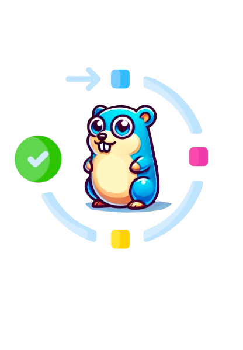

<div align="center">
    
    <div  align="center" style="max-width: 750px">
        <a style="padding: 0 5px" href="https://goreportcard.com/report/github.com/luno/workflow"></a>
        <a style="padding: 0 5px" href="https://sonarcloud.io/summary/new_code?id=luno_workflow"></a>
        <a style="padding: 0 5px" href="https://sonarcloud.io/summary/new_code?id=luno_workflow"></a>
        <a style="padding: 0 5px" href="https://sonarcloud.io/summary/new_code?id=luno_workflow"></a>
        <a style="padding: 0 5px" href="https://sonarcloud.io/summary/new_code?id=luno_workflow"></a><a style="text-decoration:none; padding: 0 5px" href="https://sonarcloud.io/summary/new_code?id=luno_workflow" ></a>
        <a style="padding: 0 5px" href="https://sonarcloud.io/summary/new_code?id=luno_workflow"></a>
        <a style="padding: 0 5px" href="https://sonarcloud.io/summary/new_code?id=luno_workflow"></a>
        <a style="padding: 0 5px" href="https://sonarcloud.io/summary/new_code?id=luno_workflow"></a>
        <a style="padding: 0 5px" href="https://pkg.go.dev/github.com/luno/workflow"></a>
        <a style="padding: 0 5px" href="https://github.com/avelino/awesome-go"></a>
    </div>
</div>

# Workflow

**The type-safe, event-driven workflow orchestration library that scales with your business.**

Build robust, distributed workflows in Go with compile-time safety, automatic retries, and horizontal scaling out of the box.

```go
// Define your business logic as type-safe state machines
b := workflow.NewBuilder[Order, OrderStatus]("order-processing")
b.AddStep(OrderCreated, ProcessPayment, PaymentProcessed)
b.AddStep(PaymentProcessed, FulfillOrder, OrderCompleted)

wf := b.Build(kafkaStreamer, sqlStore, roleScheduler)
```

## Why Choose Workflow?

### 🎯 **Type-Safe by Design**
Unlike other orchestrators, Workflow leverages Go generics for **compile-time guarantees**. Catch errors before deployment, not in production.

```go
// Your IDE knows exactly what data flows where
func processPayment(ctx context.Context, r *workflow.Run[Order, OrderStatus]) (OrderStatus, error) {
    // r.Object is typed as *Order, OrderStatus is your enum
    // Compiler catches mismatches before they cause runtime errors
}
```

### ⚡ **Event-Driven Architecture**
Built for modern distributed systems. Steps communicate through durable events, enabling:
- **Loose coupling** between workflow components
- **Automatic retries** with exponential backoff
- **Horizontal scaling** across multiple instances
- **Fault tolerance** that survives network partitions

### 🔧 **Infrastructure Agnostic**
Your choice of database, message queue, and coordination service. Start simple, scale when needed:

```go
// Development: Everything in-memory
wf := b.Build(memstreamer.New(), memrecordstore.New(), memrolescheduler.New())

// Production: Battle-tested infrastructure
wf := b.Build(kafkastreamer.New(), sqlstore.New(), rinkrolescheduler.New())
```

### 📊 **Built-in Observability**
Production-ready monitoring without the setup overhead:
- **Prometheus metrics** for throughput, latency, and error rates
- **Web UI** for real-time workflow visualization
- **Structured logging** with correlation IDs
- **Distributed tracing** support

## Perfect For

- **Order Processing**: Payment, inventory, fulfillment pipelines
- **User Onboarding**: Multi-step verification and activation flows
- **Financial Operations**: Transaction processing with compliance checks
- **Data Processing**: ETL pipelines with validation and cleanup
- **Approval Workflows**: Multi-stakeholder review processes

## vs. The Alternatives

| Feature | **Workflow** | Temporal | Zeebe/Camunda |
|---------|-------------|----------|---------------|
| **Type Safety** | ✅ Compile-time (Go generics) | ❌ Runtime validation | ❌ Runtime (BPMN) |
| **Architecture** | ✅ Event-driven state machines | ⚠️ RPC-based activities | ⚠️ Token-based execution |
| **Infrastructure** | ✅ Your choice (adapters) | ❌ Requires Temporal cluster | ❌ Requires external engine |
| **Deployment** | ✅ Library in your app | ❌ Separate server/workers | ❌ Separate engine |
| **Learning Curve** | ✅ Native Go patterns | ⚠️ New concepts & SDKs | ❌ BPMN modeling |
| **Language** | ✅ Go-native | ⚠️ Multi-language via gRPC | ⚠️ Multi-language |

## Quick Start

```bash
go get github.com/luno/workflow
```

```go
package main

import (
    "context"
    "fmt"
    "github.com/luno/workflow"
    "github.com/luno/workflow/adapters/memstreamer"
    "github.com/luno/workflow/adapters/memrecordstore"
    "github.com/luno/workflow/adapters/memrolescheduler"
)

type TaskStatus int
const (
    TaskStatusUnknown   TaskStatus = 0
    TaskStatusCreated   TaskStatus = 1
    TaskStatusProcessed TaskStatus = 2
    TaskStatusCompleted TaskStatus = 3
)

type Task struct {
    ID   string
    Name string
}

func main() {
    b := workflow.NewBuilder[Task, TaskStatus]("task-processor")

    b.AddStep(TaskStatusCreated, func(ctx context.Context, r *workflow.Run[Task, TaskStatus]) (TaskStatus, error) {
        fmt.Printf("Processing: %s\n", r.Object.Name)
        return TaskStatusProcessed, nil
    }, TaskStatusProcessed)

    b.AddStep(TaskStatusProcessed, func(ctx context.Context, r *workflow.Run[Task, TaskStatus]) (TaskStatus, error) {
        fmt.Printf("Completed: %s\n", r.Object.Name)
        return TaskStatusCompleted, nil
    }, TaskStatusCompleted)

    wf := b.Build(memstreamer.New(), memrecordstore.New(), memrolescheduler.New())

    ctx := context.Background()
    wf.Run(ctx)
    defer wf.Stop()

    // Trigger a workflow
    runID, _ := wf.Trigger(ctx, "task-1", workflow.WithInitialValue(&Task{
        ID: "task-1",
        Name: "Process Invoice",
    }))

    // Wait for completion (any terminal status)
    wf.WaitForComplete(ctx, "task-1", runID)
    fmt.Println("✅ Workflow completed!")
}
```

## Enterprise Ready

**Workflow** provides enterprise-grade features:

- ✅ **Exactly-once processing** guarantees via transactional outbox pattern
- ✅ **Built-in error handling** with pause and retry mechanisms
- ✅ **Comprehensive observability** via Prometheus metrics and Web UI
- ✅ **Horizontal scaling** through role-based scheduling
- ✅ **Infrastructure flexibility** via pluggable adapters
- ✅ **Production deployment** patterns for various scales

## Documentation

| Topic | Description |
|-------|-------------|
| **[Getting Started](docs/getting-started.md)** | Install and build your first workflow |
| **[Core Concepts](docs/concepts.md)** | Understand Runs, Events, and State Machines |
| **[Architecture](docs/architecture.md)** | Deep dive into system design and components |
| **[Steps](docs/steps.md)** | Build workflow logic with step functions |
| **[Adapters](docs/adapters.md)** | Infrastructure integration guide |
| **[Database Setup](docs/database-setup.md)** | Complete MariaDB/MySQL & PostgreSQL setup guide |
| **[Callbacks](docs/callbacks.md)** | Handle external events and webhooks |
| **[Timeouts](docs/timeouts.md)** | Add time-based operations |
| **[Connectors](docs/connectors.md)** | Integrate with external event streams |
| **[Hooks](docs/hooks.md)** | React to workflow lifecycle changes |
| **[Configuration](docs/configuration.md)** | Tune performance and behaviour |
| **[Monitoring](docs/monitoring.md)** | Observability and debugging |

### Examples & Tutorials

| Example | Description |
|---------|-------------|
| **[Getting Started](docs/getting-started.md)** | Your first workflow in 5 minutes |
| **[SQL Example](_examples/sqlexample)** | Complete MariaDB/MySQL integration with Docker |
| **[Order Processing](_examples/orderprocessor)** | Complex e-commerce workflow with payments & fulfilment |
| **[Callbacks](_examples/callback)** | Handle external webhooks and events |
| **[Timeouts](_examples/timeout)** | Schedule and timeout operations |
| **[Connectors](_examples/connector)** | Integrate with external event streams |


## Community & Support

- 📚 **[Documentation](docs/)** - Comprehensive guides and examples
- 🐛 **[Issues](https://github.com/luno/workflow/issues)** - Bug reports and feature requests
- 💬 **[Discussions](https://github.com/luno/workflow/discussions)** - Community Q&A

## Installation

```bash
go get github.com/luno/workflow

# Production adapters (install as needed)
go get github.com/luno/workflow/adapters/kafkastreamer
go get github.com/luno/workflow/adapters/sqlstore
go get github.com/luno/workflow/adapters/rinkrolescheduler
go get github.com/luno/workflow/adapters/webui
```

## License

[MIT License](LICENSE)

---

**Ready to build reliable workflows?** [Get started in 5 minutes →](docs/getting-started.md)