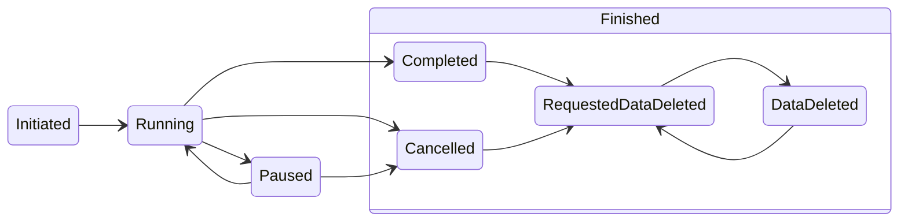

# Core Concepts

This document explains the fundamental concepts that make Workflow powerful and how they work together to create robust, distributed workflow systems.

## Workflows

A **Workflow** is a definition of how data should flow through a series of steps to accomplish a business process. In Workflow, workflows are:

- **Type-safe**: Using Go generics, your data type and status enum are checked at compile time
- **Event-driven**: Steps communicate through events, enabling distributed execution
- **Durable**: All state changes are persisted, surviving restarts and failures
- **Scalable**: Role-based scheduling allows horizontal scaling across multiple instances

```go
// A workflow processes data of type Order through OrderStatus states
type Workflow[Order, OrderStatus] interface {
    Trigger(ctx context.Context, foreignID string, opts ...TriggerOption) (string, error)
    Await(ctx context.Context, foreignID, runID string, status OrderStatus) (*Run[Order, OrderStatus], error)
    WaitForComplete(ctx context.Context, foreignID, runID string, opts ...AwaitOption) (*Run[Order, OrderStatus], error)
    Callback(ctx context.Context, foreignID string, status OrderStatus, payload io.Reader) error
    Run(ctx context.Context)
    Stop()
}
```

### Await vs WaitForComplete

The Workflow interface provides two methods for waiting for workflow completion:

- **`Await()`**: Waits for a specific status to be reached. Useful when you need to wait for intermediate steps or when you have multiple terminal statuses and care which one is reached.
  ```go
  run, err := wf.Await(ctx, foreignID, runID, OrderStatusCompleted)
  ```

- **`WaitForComplete()`**: Waits for any terminal status to be reached. Simpler to use when you just want to know when the workflow finishes, regardless of which terminal status is reached.
  ```go
  run, err := wf.WaitForComplete(ctx, foreignID, runID)
  // run.Status contains whichever terminal status was reached
  ```

## Runs

A **Run** is an individual instance of a workflow processing specific data. When you call `Trigger()`, you create a new Run.

```go
type Run[Type any, Status StatusType] struct {
    WorkflowName string
    ForeignID    string    // Your unique identifier for this business entity
    RunID        string    // Unique identifier for this specific run
    RunState     RunState  // Lifecycle state (Initiated, Running, Completed, etc.)
    Status       Status    // Your workflow-specific status
    Object       *Type     // Your business data
    CreatedAt    time.Time
    UpdatedAt    time.Time
}
```

### Run Lifecycle (RunState)

Every Run progresses through a finite state machine:

| RunState | Value | Description |
|----------|-------|-------------|
| **Unknown** | 0 | Default zero value, has no meaning |
| **Initiated** | 1 | Run created but not yet processed |
| **Running** | 2 | Currently being processed by a workflow step |
| **Paused** | 3 | Temporarily stopped (usually due to errors) |
| **Cancelled** | 4 | Terminated before completion |
| **Completed** | 5 | Successfully finished all steps |
| **DataDeleted** | 6 | Data has been scrubbed/deleted |
| **RequestedDataDeleted** | 7 | Data deletion requested (e.g., for GDPR) |



### Your Custom Status vs RunState

- **Your Status**: Business-specific states you define (e.g., `OrderCreated`, `PaymentProcessed`)
- **RunState**: System-level lifecycle state that Workflow manages

A Run can be `RunStateRunning` with status `OrderCreated`, meaning the system is actively processing your order that's currently in the "created" state.

## Events

**Events** are the mechanism by which workflow steps communicate and trigger each other.

```go
type Event struct {
    ID        int64             // Unique event identifier
    ForeignID string            // Links to workflow instance
    Type      int               // Status the workflow moved to
    Headers   map[Header]string // Metadata
    CreatedAt time.Time         // Event timestamp
}
```

### Event Flow

1. Step completes and returns a new Status
2. Workflow persists the Run with new Status
3. Event is published to the EventStreamer
4. Next step's consumer receives the event
5. Next step processes the Run

This event-driven architecture enables:
- **Loose coupling**: Steps don't directly call each other
- **Reliability**: Events are persisted and retried on failure
- **Observability**: All state changes are observable as events
- **Scalability**: Different steps can run on different machines

## State Machines

Workflows are **state machines** where:
- **States** are your Status enum values
- **Transitions** are defined by your step functions
- **Data** (your Object) flows through the states

Unlike traditional state machines, Workflow state machines:
- **Support cycles**: Steps can transition back to previous states or themselves
- **Carry data**: The Object is modified as it flows through states
- **Are distributed**: Different states can be processed on different machines
- **Are durable**: All state changes are persisted

```go
b := workflow.NewBuilder[Order, OrderStatus]("order-processing")

// Define valid transitions
b.AddStep(OrderCreated, processPayment, PaymentProcessed, PaymentFailed)
b.AddStep(PaymentProcessed, reserveInventory, InventoryReserved, InventoryFailed)
b.AddStep(InventoryReserved, fulfillOrder, OrderFulfilled)

// Cycles are allowed - orders can be retried
b.AddStep(PaymentFailed, retryPayment, PaymentProcessed, OrderCancelled)
```

## Role-Based Scheduling

**Role Scheduling** ensures that only one instance of each process runs at any time, even in a distributed environment.

### How It Works

Each workflow step creates a unique role:

```
workflow-name-status-consumer-shard-of-total-shards
```

Examples:
- `order-processing-1-consumer-1-of-1` (single instance)
- `order-processing-2-consumer-1-of-3` (sharded across 3 instances)

The RoleScheduler ensures only one process holds each role at any time, enabling:

- **Horizontal scaling**: Multiple machines can run different roles
- **Load distribution**: Heavy steps can be sharded across multiple instances
- **Fault tolerance**: If a machine fails, another can take over its roles

### Sharding

For high-throughput steps, you can shard across multiple processes:

```go
b.AddStep(OrderCreated, processPayment, PaymentProcessed).
    WithOptions(workflow.ParallelCount(5)) // Run 5 parallel instances
```

This creates roles:
- `order-processing-1-consumer-1-of-5`
- `order-processing-1-consumer-2-of-5`
- `order-processing-1-consumer-3-of-5`
- `order-processing-1-consumer-4-of-5`
- `order-processing-1-consumer-5-of-5`

Events are distributed across shards using consistent hashing on the ForeignID.

## Type Safety

Workflow uses Go generics to provide compile-time safety:

```go
// This workflow processes Orders through OrderStatus states
type OrderWorkflow = workflow.Workflow[Order, OrderStatus]

// Step functions are fully typed
func processPayment(ctx context.Context, r *workflow.Run[Order, OrderStatus]) (OrderStatus, error) {
    // r.Object is typed as *Order
    // Return value must be OrderStatus
    // Compiler catches type mismatches
}
```

Benefits:
- **Compile-time validation**: Catch errors before deployment
- **IDE support**: Full autocompletion and refactoring
- **Self-documenting**: Types clearly show what data flows where
- **Refactoring safety**: Changing types updates all usages

## Adapters

**Adapters** make Workflow infrastructure-agnostic by providing interfaces for:

- **EventStreamer**: How events are published and consumed (Kafka, in-memory, etc.)
- **RecordStore**: Where Run data is stored (SQL, NoSQL, in-memory, etc.)
- **RoleScheduler**: How roles are coordinated (distributed locks, single-instance, etc.)
- **TimeoutStore**: Where timeout schedules are stored (SQL, in-memory, etc.)

```go
// Production setup
wf := b.Build(
    kafkastreamer.New(brokers, config),
    sqlstore.New(db, "workflow_records", "workflow_outbox"),
    rinkrolescheduler.New(rinkConfig),
    workflow.WithTimeoutStore(sqltimeout.New(db)),
)

// Development setup
wf := b.Build(
    memstreamer.New(),
    memrecordstore.New(),
    memrolescheduler.New(),
)
```

## Durability and Consistency

Workflow ensures **exactly-once processing** and **at-least-once delivery** through:

### Transactional Outbox Pattern

1. Run state change and outbox event are stored in a single transaction
2. Background process publishes outbox events to EventStreamer
3. Events are deleted from outbox only after successful publication

### Idempotency

- Each Run has a unique combination of (WorkflowName, ForeignID, RunID)
- Steps can be safely retried without duplicate processing
- Use RunID as idempotency key in external systems

### Error Handling

- Steps can return errors to trigger retries with exponential backoff
- After configurable error count, Runs are paused for manual investigation
- Errors are tracked per process to avoid cascade failures

```go
b.AddStep(OrderCreated, processPayment, PaymentProcessed).
    WithOptions(
        workflow.PauseAfterErrCount(5),        // Pause after 5 errors
        workflow.ErrBackOff(time.Second * 30), // Wait 30s between retries
    )
```

## Observability

Workflow provides comprehensive observability:

### Metrics
- Prometheus metrics for lag, throughput, and error rates
- Per-step and per-workflow breakdowns
- Consumer health and role assignment status

### Events
- All state changes generate events
- Events can be consumed by external systems for monitoring
- Full audit trail of workflow execution

### Debugging
- Web UI for visualizing workflow state
- Debug mode for detailed logging
- Programmatic access to workflow state

## Next Steps

Now that you understand the core concepts, explore:

- **[Architecture](architecture.md)** - Deep dive into system design
- **[Steps](steps.md)** - Building workflow logic
- **[Adapters](adapters.md)** - Infrastructure integration
- **[Examples](examples/)** - Real-world patterns