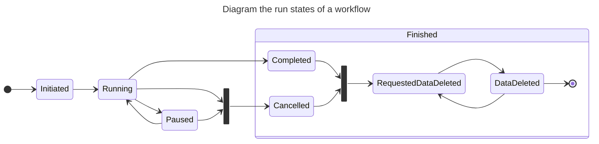

```mermaid
---
title: Diagram the run states of a workflow
---
stateDiagram-v2
	direction LR
    
	[*]-->Initiated

    Initiated-->Running
    
    Running-->Completed
    Running-->Paused

    Paused-->Running
    
    state join_state_1 <<join>>
    Running --> join_state_1
    Paused --> join_state_1
    join_state_1 --> Cancelled
    
    state Finished {
        state join_state_2 <<join>>
        Completed --> join_state_2
        Cancelled --> join_state_2
        join_state_2 --> RequestedDataDeleted
            

        DataDeleted-->RequestedDataDeleted
        RequestedDataDeleted-->DataDeleted
        DataDeleted-->[*]
    }
```
