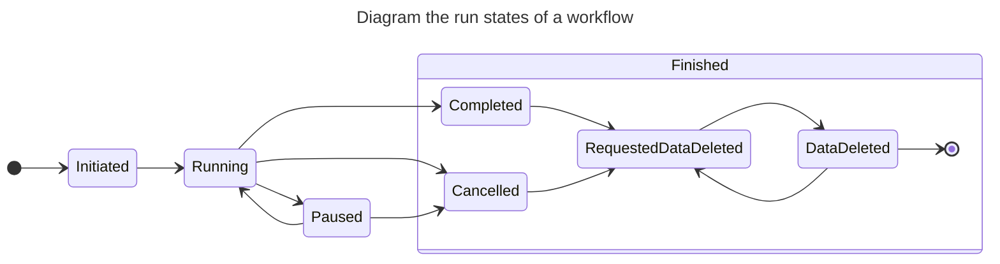

```mermaid
---
title: Diagram the run states of a workflow
---
stateDiagram-v2
    direction LR

    [*]-->Initiated

    Initiated-->Running

    Running-->Completed
    Running-->Paused

    Paused-->Running

    Running --> Cancelled
    Paused --> Cancelled

    state Finished {
        Completed --> RequestedDataDeleted
        Cancelled --> RequestedDataDeleted

        DataDeleted-->RequestedDataDeleted
        RequestedDataDeleted-->DataDeleted
        DataDeleted-->[*]
    }
```
